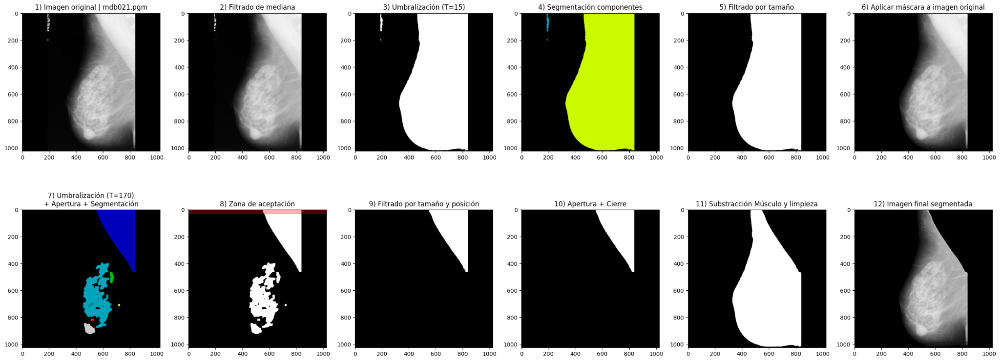
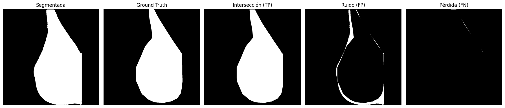

# MammaryTissueClassifier

Desarrollé un sistema automático para segmentar la región mamaria en mamografías laterales y clasificar el tejido en graso, glandular-graso o glandular-denso, con el objetivo de apoyar el diagnóstico radiológico mediante análisis morfológico y de textura.

La herramienta permite obtener métricas de segmentación (IoU) y evaluar clasificadores entrenados con características extraídas del tejido mamario.

<p align="center">
  
</p>

<p align="center">
  
</p>

## Descripción

Este repositorio contiene un pipeline completo para:

1. **Segmentación automática**: detección de la región de tejido mamario, eliminando músculo pectoral y artefactos.
2. **Extracción de características**: cálculo de intensidad, entropía local y propiedades GLCM (contraste, energía, homogeneidad).
3. **Clasificación del tejido**: uso de modelos Random Forest y SVM validados con *k*-fold CV estratificada.
4. **Evaluación cuantitativa**: métricas como IoU, precisión, recall y F1-score por clase.
5. **Visualización y resultados**: gráficos de segmentación, tablas y matriz de confusión.

## Ejecución

De forma interactiva con Jupyter Notebook (`p3.ipynb`):

```bash
jupyter notebook p3.ipynb
```

## Requisitos

Este entorno fue probado con las siguientes versiones:

```txt
matplotlib==3.10.3
numpy==2.2.6
opencv_contrib_python==4.11.0.86
pandas==2.3.0
scipy==1.15.3
seaborn==0.13.2
skimage==0.0
```

Instala las dependencias necesarias con:

```bash
pip install -r requirements.txt
```

## Datos

Las imágenes empleadas en este proyecto provienen del conjunto **mini-MIAS** (*Mammographic Image Analysis Society*), disponible públicamente en:

http://peipa.essex.ac.uk/info/mias.html

Este subconjunto fue distribuido a través del campus virtual del Máster en Bioinformática para las Ciencias de la Salud (curso 2024/2025) para fines educativos.
